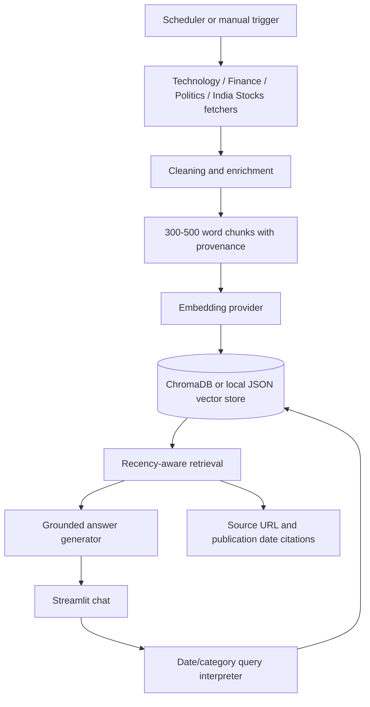

# System Architecture

## Runtime boundaries

- Fetching, processing, embeddings, vector storage, and scheduled work belong in the Python service/worker.
- Streamlit Community Cloud hosts the demo UI; Vercel hosts the lightweight health API, while the worker and durable vector backend belong on a Python-compatible host.
- `NEWS_RAG_VECTOR_BACKEND=json` is the free/local fallback; production deployments should select Chroma with a durable mounted or external storage path.
- The worker supports daily/hourly intervals and can emit structured JSON logs with `NEWS_RAG_STRUCTURED_LOGS=1`.
- Every chunk carries category, source, URL, publication date, title, tags, and entities.
- The query engine refuses when filtered retrieval returns no evidence.

## Operational concerns

Source licensing, API rate limits, provider credentials, retry behavior, vector-store backups, external alerting, cost controls, and measured evaluation scores must be reviewed before production deployment.
