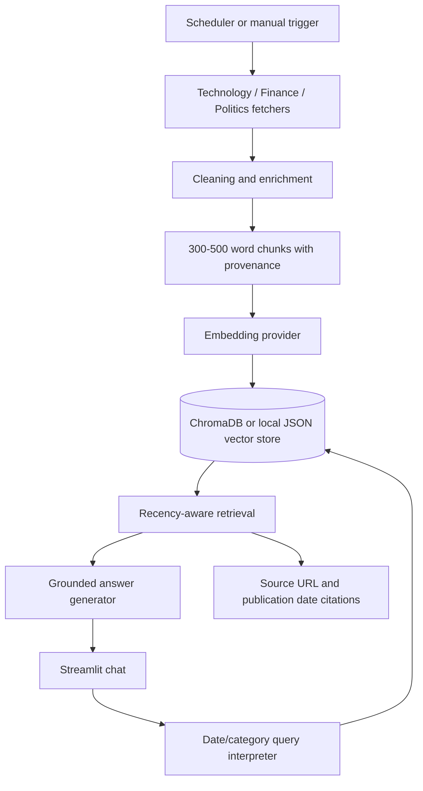

# System Architecture

## Runtime boundaries

- Fetching, processing, embeddings, vector storage, and scheduled work belong in the Python service/worker.
- The initial Streamlit app is a local/demo UI. The planned production frontend can run on Vercel and call a separately hosted Python API.
- Every chunk carries category, source, URL, publication date, title, tags, and entities.
- The query engine refuses when filtered retrieval returns no evidence.

## Operational concerns

Source licensing, API rate limits, provider credentials, retry behavior, vector-store backups, logs, cost controls, and evaluation scores must be reviewed before production deployment.
