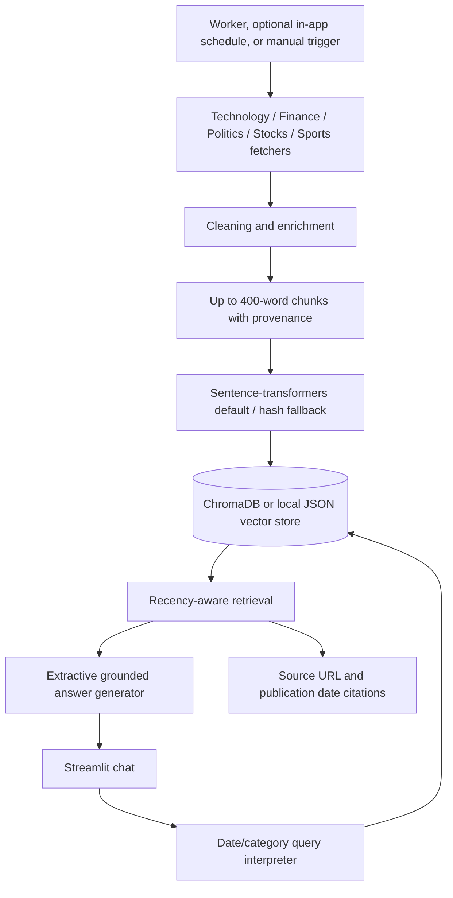

# System Architecture

## Runtime boundaries

- `rss.py` owns feed retrieval, caching, parsing, and article hydration; `ingestion.py` owns category fetchers, deduplication, and category quotas.
- `embeddings.py` owns embedding providers; `vector_store.py` owns JSON and Chroma persistence adapters. `query_engine.py` handles retrieval orchestration and `answer_generation.py` handles text intent and extractive responses.
- The Streamlit entrypoint delegates sidebar ingestion controls to `ingestion_view.py` and current-day article rendering to `briefing_view.py`.
- Fetching, processing, embeddings, vector storage, and scheduled work belong in the Python service/worker.
- Streamlit Community Cloud hosts the demo UI; Vercel hosts the lightweight health API, while the worker and durable vector backend belong on a Python-compatible host.
- `NEWS_RAG_VECTOR_BACKEND=json` is the free/local fallback; production deployments should select Chroma with a durable mounted or external storage path.
- The default feeds are LiveMint category feeds plus Yahoo Finance for Finance; configured feeds are filtered for category and India relevance.
- Sentence-transformers is the default embedding provider; if the package is missing, the app falls back to hash embeddings and shows a warning. Set `NEWS_RAG_EMBEDDING_PROVIDER=hash` to explicitly use the dependency-free provider. No LLM generator is currently wired into the query path.
- Rebuild the index after changing the embedding provider or model; the vector store detects and rejects incompatible persisted vectors.
- The standalone worker supports configurable intervals through `NEWS_RAG_INTERVAL_SECONDS` and can emit structured JSON logs with `NEWS_RAG_STRUCTURED_LOGS=1`. Streamlit-only sessions can opt into timed ingestion with `NEWS_RAG_AUTO_INGEST_SECONDS`.
- Every chunk carries category, source, URL, publication date, title, tags, entities, and a summary derived from the RSS summary when available.
- For daily headline requests, category-matched article titles provide concise answers; category headline titles are checked for topical evidence so a mislabeled feed item is not presented as a matching headline. Category summaries prefer stored RSS summaries, falling back to article text when no summary exists.
- Other questions receive relevant sentences selected from retrieved chunks. Unsupported requests for certainty about future events are refused, and filtered queries with no matching evidence return a no-answer response. The query path does not compose new prose with an LLM.

## Operational concerns

Source licensing, API rate limits, provider credentials, retry behavior, vector-store backups, external alerting, cost controls, and measured evaluation scores must be reviewed before production deployment.
